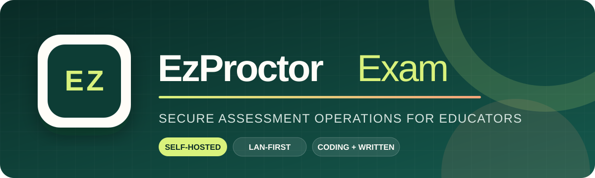
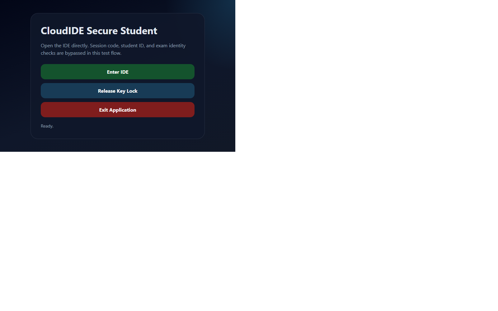
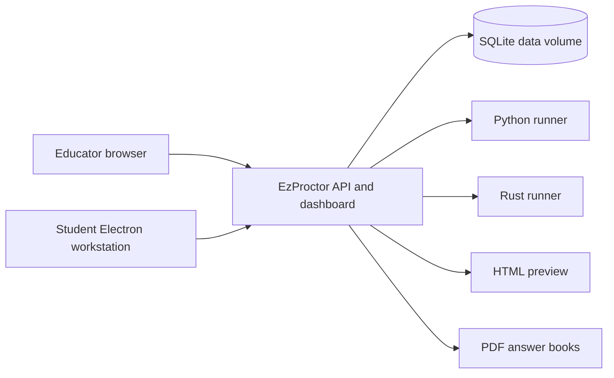

<p align="center">
  
</p>

<p align="center">
  <a href="https://ezproctor.ejoetso.com"><strong>Product website</strong></a> &middot;
  <a href="https://github.com/edutech-ET/EzProctor/releases/latest"><strong>Latest release</strong></a> &middot;
  <a href="docs/USER_GUIDE.md"><strong>User guide</strong></a> &middot;
  <a href="https://ezproctor.ejoetso.com/#start"><strong>Request an activation key</strong></a>
</p>

# EzProctor Exam

EzProctor&trade; Exam is a self-hosted assessment operations platform for educators and students. It combines exam authoring, question import, secure student check-in, written responses, Python/Rust/HTML practical coding, autosave, live session monitoring, educator-confirmed grading, feedback, and PDF answer books in one connected workflow.

For educational activation, implementation support, product feedback, or collaboration, use the [EzProctor inquiry form](https://ezproctor.ejoetso.com/#start) or email **eozoe2025@gmail.com**.

## Product demos

### [Watch or download the educator workflow demo](docs/videos/educator-demo.mp4)

<p align="center">
  <a href="docs/videos/educator-demo.mp4"></a>
</p>

| Student secure entry | Student practical IDE |
| --- | --- |
|  |  |

| Educator command center | EzProctor entry page |
| --- | --- |
|  |  |

| Walkthrough | What it covers |
| --- | --- |
| [Educator demo](docs/videos/educator-demo.mp4) | Question import, model answers, sessions, monitoring, grading, feedback, and PDF export |
| [Student demo](docs/videos/student-demo.mp4) | Check-in, question navigation, Python testing, autosave, review, and submission |
| [Implementation guide](docs/videos/implementation-guide.mp4) | Docker deployment, configuration, validation, backup, and upgrades |

Read the complete [illustrated EzProctor user guide](docs/USER_GUIDE.md).

## Copyright and usage

Copyright &copy; 2026 Ejoe Tso. All rights reserved. EzProctor&trade; is a trademark of Ejoe Tso.

This repository is public and source-available. EzProctor is free for licensed educational institutions, but platform activation is required. Commercial redistribution, paid hosted use, sublicensing, and commercial derivative products require written permission from Ejoe Tso.

These education-focused conditions restrict fields of use, so this is not an OSI-approved open-source license. See [LICENSE](LICENSE), the [Trademark Notice](TRADEMARK.md), and the [Activation Guide](docs/ACTIVATION_GUIDE.md).

## Local evaluation account

After activating a local deployment, educators can evaluate the complete workflow with the initial account:

- Username: `ezproctor`
- Password: `admin@123`
- Educator console: `http://localhost:8787/admin-app/`
- Student entry: `http://localhost:8787/exam-mode`

Change the educator credentials in `.env` before any production or shared-network deployment. Students do not need platform accounts; they enter an active session using the details released by the educator.

## Educational activation

A new EzProctor server must be activated with an authorised educational institution key before protected educator, student, and API workflows are unlocked.

1. Request a free educational key through the [activation form](https://ezproctor.ejoetso.com/#start).
2. Open the educator console after deployment.
3. Enter the institution name, contact email, and activation key.
4. Activate the central server once. Student workstations do not require separate keys.

Activation state is stored with the application data. Docker Compose keeps this data in the `ezproctor_data` volume, so activation survives container rebuilds and restarts. Back up the data volume as part of normal operations.

Keys are distributed separately and are never committed to this repository. Read the [Activation Guide](docs/ACTIVATION_GUIDE.md) for the complete workflow.

## Capabilities

- Import questions from Word, Markdown, text, CSV, and JSON sources.
- Ignore instructions, introductions, candidate rules, and other non-question content.
- Classify multiple-choice, short-response, long-response, coding, frontend, and debugging questions.
- Import model answers and map them to existing exam questions for advisory pre-grading.
- Create exams and sessions, assign learners, approve check-ins, and control exam release.
- Provide question navigation, answer status, autosave, review, and final submission.
- Run Python and Rust code or refresh an HTML preview during practical exams.
- Give each coding task a clean language-specific primary file and optional student-created modules.
- Keep the latest official answer for every student and question synchronized to the database.
- Monitor active students, sessions, progress, risk events, and submission state.
- Grade by student and question, save marks and feedback, and retain educator confirmation.
- Export individual, session-wide, and exam-wide PDF answer books.
- Deploy as a Docker web service with a Windows Electron student workstation client.

## Requirements

Choose either:

- Docker Engine 24+ with Docker Compose, or
- Node.js 22+ and npm 10+ for native development.

Student workstations require Windows 10 or Windows 11 and network access to the central educator server. The downloadable MSI includes Electron and the student application; no Node.js installation is required on student PCs.

The Docker image includes Python and Rust. Native Windows Rust execution with the MSVC target additionally requires Visual Studio Build Tools with the **Desktop development with C++** workload.

## Quick start with Docker

```bash
git clone https://github.com/edutech-ET/EzProctor.git
cd EzProctor
cp .env.example .env
docker compose up --build -d
```

Open `http://localhost:8787/admin-app/` for the educator console and `http://localhost:8787/exam-mode` for student check-in.

Check service status and logs:

```bash
docker compose ps
docker compose logs -f ezproctor
```

Stop the deployment:

```bash
docker compose down
```

Do not use `docker compose down -v` unless you intentionally want to remove the persistent database and activation state.

## Student workstation

Download `EzProctor-Exam-Student-0.1.0-Setup.msi` from the [latest GitHub release](https://github.com/edutech-ET/EzProctor/releases/latest).

On first launch, enter the central server address supplied by the institution, for example:

```text
http://192.168.1.10:8787
```

The educator server and student workstations must be reachable on the same trusted network unless the institution has configured a secure remote deployment. See the [Workstation Setup Guide](docs/WORKSTATION_SETUP_GUIDE.md) for MSI deployment, firewall, LAN discovery, and laboratory rollout instructions.

## Native local development

```powershell
npm ci
npm run build:dashboard
npm run dev:backend
```

Open `http://localhost:8787/admin-app/`. For the complete Electron development stack:

```powershell
npm run dev
```

Build the Windows student installer:

```powershell
npm run build:student
```

Useful validation commands:

```powershell
npm run lint
npm run build:dashboard
node --check backend/src/server.js
docker compose config
```

## Configuration

Copy `.env.example` to `.env` and review these core variables:

| Variable | Purpose | Default |
| --- | --- | --- |
| `BACKEND_PORT` | Central EzProctor service port | `8787` |
| `DASHBOARD_ALLOWED_ORIGIN` | Allowed dashboard development origin | `http://localhost:5173` |
| `EDUCATOR_USERNAME` | Initial educator login name | `ezproctor` |
| `EDUCATOR_PASSWORD` | Initial educator password | `admin@123` |
| `EDUCATOR_SESSION_HOURS` | Educator login lifetime | `8` |
| `OPENAI_API_KEY` | Optional AI-assisted import and grading key | empty |
| `OPENAI_MODEL` | Optional OpenAI model used by assistance features | `gpt-4o-mini` |
| `RUSTC_EXECUTABLE` | Optional explicit Rust compiler path | auto-detected |
| `CLOUDIDE_SECURE_DATA_DIR` | Persistent database and activation directory | `backend/data` locally |

Never commit a real `.env` file, activation keys, databases, logs, or exported student records. These paths are excluded from Git.

## User workflow

See the [role-based user guide](docs/USER_GUIDE.md) or watch the [educator](docs/videos/educator-demo.mp4) and [student](docs/videos/student-demo.mp4) workflow videos.

### Educator

1. Activate the central EzProctor server and sign in to the educator console.
2. Create an exam or import a question paper.
3. Review question numbering, question types, marks, starter code, and optional model answers.
4. Create a session, assign or import students, and configure access details and timing.
5. Release the session and approve student check-ins.
6. Monitor attendance, progress, answer status, and submission activity.
7. Review each student's latest answer by question.
8. Confirm marks and feedback, then export individual or combined PDF answer books.

### Student

1. Open the institution-provided student workstation application.
2. Enter or confirm the central EzProctor server address.
3. Check in using the released session and student details.
4. Wait for educator approval and exam release.
5. Navigate questions, enter written answers, and use the practical IDE when coding is required.
6. Run code to inspect program output without exposing infrastructure-specific diagnostics.
7. Review answered and unanswered questions, then submit the exam.

## Production implementation

1. Deploy EzProctor on an institution-controlled server using Docker Compose.
2. Copy `.env.example` to `.env` and replace the default educator credentials.
3. Keep `backend/data` or the `ezproctor_data` Docker volume on persistent, backed-up storage.
4. Activate the central server with the institution's authorised key.
5. Allow TCP port `8787` only on the trusted assessment network, or place the service behind a managed HTTPS reverse proxy.
6. Install the signed or institution-approved MSI on student workstations.
7. Configure each workstation with the central server's LAN or HTTPS address.
8. Run a complete drill session before the first live assessment.
9. Define local privacy, retention, accessibility, incident, and invigilation procedures.

For detailed deployment and validation steps, read the [Installation Guide](docs/INSTALLATION_GUIDE.md) and [Implementation Guide](docs/IMPLEMENTATION_GUIDE.md).

## Architecture and operational notes



- The educator dashboard, student web experience, API, WebSocket monitoring, code runners, and PDF export are served by the central application.
- Student work is synchronized to SQLite and the latest official answer is retained for grading.
- AI-assisted question import and pre-grading are advisory; educators remain responsible for final marks and feedback.
- Rust and Python execution must be isolated to the institution's approved server environment.
- Back up the data volume before upgrades and test restoration as part of operational readiness.

## Security checklist

- Change the default educator credentials before shared use.
- Keep activation keys and `.env` values outside source control.
- Restrict the educator console and backend to trusted networks.
- Use HTTPS for remote or multi-site deployments.
- Maintain operating-system, Docker, Python, Rust, and Electron security updates.
- Confirm that exported answer books and database backups follow institutional retention policy.
- Test workstation lockdown, reconnect behavior, autosave, code execution, and submission before each assessment period.
- Review privacy and consent requirements for monitoring and recorded student activity.

## Documentation

- [Installation Guide](docs/INSTALLATION_GUIDE.md)
- [Implementation Guide](docs/IMPLEMENTATION_GUIDE.md)
- [Workstation Setup Guide](docs/WORKSTATION_SETUP_GUIDE.md)
- [Activation Guide](docs/ACTIVATION_GUIDE.md)
- [Role-Based User Guide](docs/USER_GUIDE.md)

## Support and collaboration

For educational activation, implementation support, product feedback, custom deployment, integration, or collaboration:

- Submit the [EzProctor inquiry form](https://ezproctor.ejoetso.com/#start)
- Email **eozoe2025@gmail.com**
- Open a GitHub issue for reproducible technical defects that do not contain student data, credentials, activation keys, or other sensitive information
