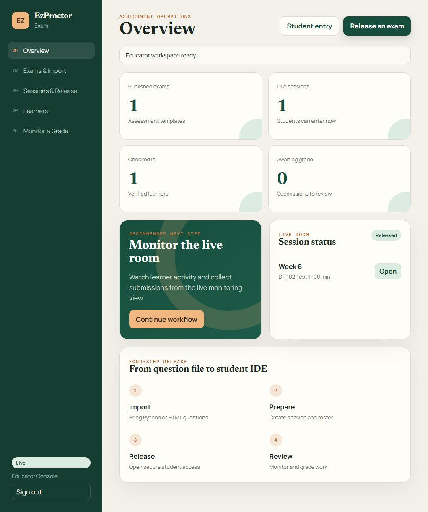
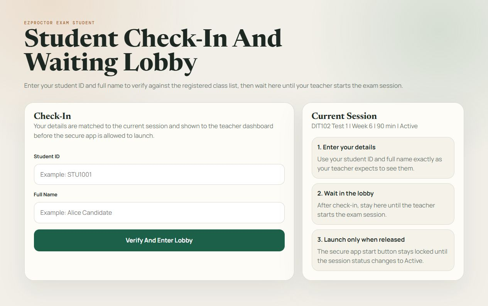
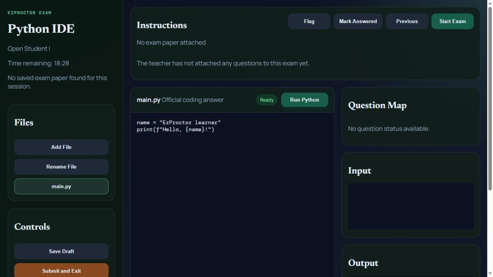
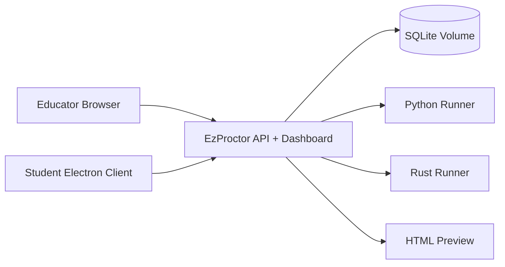

# EzProctor Exam

EzProctor Exam is an educator-controlled coding assessment platform with exam authoring, secure student check-in, Python/Rust/HTML execution, autosaved question responses, live session monitoring, grading, and PDF answer books.



## Quick Start with Docker

```bash
git clone https://github.com/edutech-ET/EzProctor.git
cd EzProctor
cp .env.example .env
docker compose up -d --build
```

Open the educator console at `http://localhost:8787/admin-app/` and the student check-in page at `http://localhost:8787/exam-mode`.

## Product Videos

| Walkthrough | Description |
| --- | --- |
| [Implementation video](docs/videos/implementation-guide.mp4) | Docker deployment, configuration, validation, backup, and upgrades |
| [Educator demo](docs/videos/educator-demo.mp4) | Question import, model answers, sessions, grading, and PDF export |
| [Student demo](docs/videos/student-demo.mp4) | Check-in, question navigation, Python testing, autosave, and submission |

GitHub displays MP4 links as downloadable/playable repository assets.

## Guides

- [Installation Guide](docs/INSTALLATION_GUIDE.md)
- [Implementation Guide](docs/IMPLEMENTATION_GUIDE.md)
- [Role-Based User Guide](docs/USER_GUIDE.md)

## Core Capabilities

- Import questions from Word, Markdown, text, CSV, and JSON.
- Ignore introductions, candidate rules, procedures, and other non-question content.
- Classify coding, frontend, debugging, multiple-choice, short, and long questions.
- Import and review model-answer mappings for advisory pre-grading.
- Create sessions, assign learners, approve check-ins, and release exams.
- Run Python and Rust code or refresh an HTML preview during practical exams.
- Keep the latest official answer for every student and question synchronized.
- Grade question by question or save all marks and feedback together.
- Export individual student, session-wide, and exam-wide PDF answer books.
- Run as a Docker web deployment or Electron student desktop client.

## Screenshots

### Student Check-In



### Student IDE



## Architecture



The Docker image includes Python and Rust. Native Windows Rust execution requires Visual Studio Build Tools with the C++ workload when using the MSVC Rust target.

## Development

```powershell
npm ci
npm run build:dashboard
npm run dev:backend
```

For the complete Electron development stack:

```powershell
npm run dev
```

Build the Windows student installer:

```powershell
npm run build:student
```

## Data and Security

- Application data is stored in `backend/data` locally or the `ezproctor_data` Docker volume.
- `.env`, databases, logs, temporary files, and exported student records are excluded from Git.
- Production should be placed behind HTTPS and restricted to trusted networks.
- Advisory grading never finalizes marks without educator confirmation.
- Organizations must define retention, privacy, accessibility, and invigilation procedures appropriate to local requirements.

## Validation

```bash
docker compose config
npm run build:dashboard
node --check backend/src/server.js
```

A full Docker image build additionally requires a running Docker engine.

## License

No open-source license has been selected yet. All rights are reserved until the project owner adds a license file.
