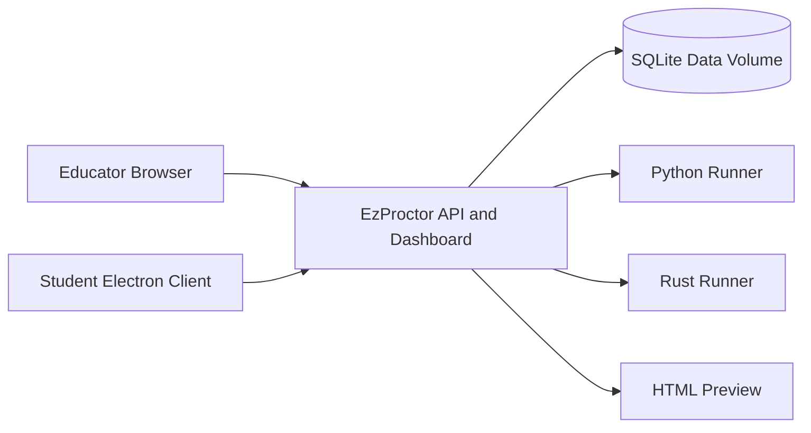

# EzProctor Exam Implementation Guide

## 1. Deployment Architecture

The Docker container hosts the educator dashboard, student check-in pages, APIs, WebSocket monitoring, SQLite database, PDF generation, Python, and Rust. Electron provides the controlled student desktop client.

## 2. Recommended Rollout

1. Deploy a staging instance.
2. Create administrator and educator operating procedures.
3. Import a small learner roster and sample exam.
4. Test Python, Rust, and HTML questions on the actual student hardware.
5. Run a supervised mock session.
6. Verify answer autosave, final submission, grading, and PDF export.
7. Back up the database volume.
8. Deploy production and freeze changes before the exam window.

## 3. Educator Workflow

1. Open **Exams & Import**.
2. Create an exam or import `.docx`, `.txt`, `.md`, `.csv`, or `.json` questions.
3. Review detected question types and remove non-question content.
4. Optionally import model answers and review the mappings.
5. Create a session under **Sessions & Release**.
6. Add/import learners and assign them to the session.
7. Release the session and approve student check-ins.
8. Monitor activity under **Monitor & Grade**.
9. Close the session to collect submissions.
10. Grade each response, save all grades, and export individual or combined PDFs.

## 4. Student Workflow

1. Launch **EzProctor Exam Student**.
2. Enter student number and full name.
3. Wait for educator approval and session release.
4. Read the instructions and navigate questions.
5. Use **Run Python**, **Run Rust**, or **Refresh Preview** to test code.
6. Move between questions; work is synchronized to the database.
7. Review answered, unanswered, and flagged questions.
8. Submit and exit.

## 5. Question Import Rules

The importer ignores introductions, candidate instructions, conduct rules, timing metadata, submission procedures, and end markers. Genuine questions are detected using numbering plus assessment evidence such as marks, question wording, answer choices, task verbs, or code.

Always review imported questions before publishing an exam.

## 6. Grading Governance

- Model answers support advisory pre-grading only.
- Suggestions remain drafts until an educator confirms them.
- Marks are validated against each question maximum.
- **Save all grades** persists question marks, feedback, final score, and status together.
- Individual student answer books and full session/exam backups can be exported as PDF.

## 7. Security and Operations

- Place production behind HTTPS using a reverse proxy.
- Restrict port `8787` to trusted networks.
- Never commit `.env`, databases, logs, or student exports.
- Use separate staging and production data volumes.
- Back up before upgrades and before each exam period.
- Define retention and deletion rules for student work under local privacy requirements.
- Treat the Electron controls as one layer of proctoring, not a replacement for invigilation.

## 8. Acceptance Checklist

- [ ] Health endpoint reports `ok: true`.
- [ ] Educator can create/import and edit questions.
- [ ] Student can check in and receive approval.
- [ ] Python code runs and displays output.
- [ ] Rust code runs in Docker or links correctly on Windows.
- [ ] HTML preview refreshes.
- [ ] Answers persist after navigating away and returning.
- [ ] Closing a session creates submissions.
- [ ] Educator can save all grades.
- [ ] Individual and combined PDFs download correctly.
- [ ] Backup and restore have been tested.

## 9. Demo Videos

- [Implementation walkthrough](videos/implementation-guide.mp4)
- [Educator workflow](videos/educator-demo.mp4)
- [Student workflow](videos/student-demo.mp4)
